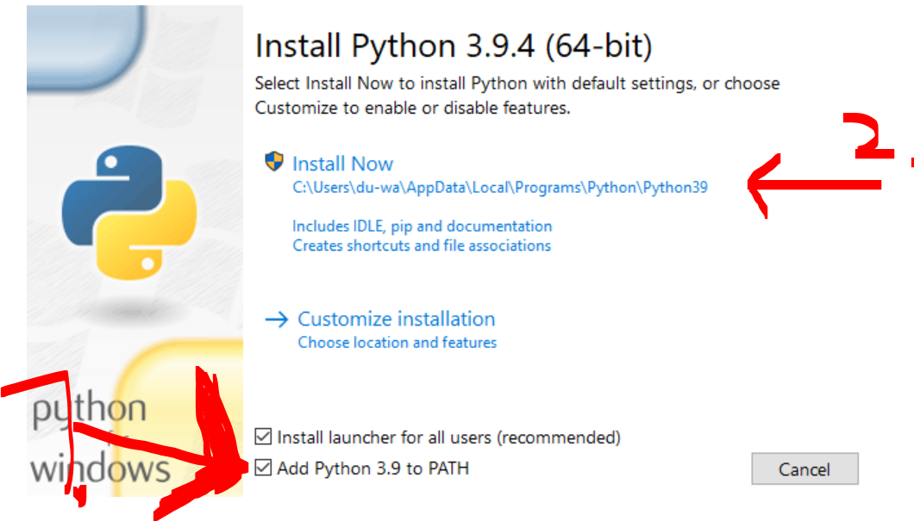
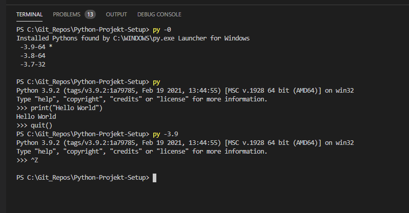
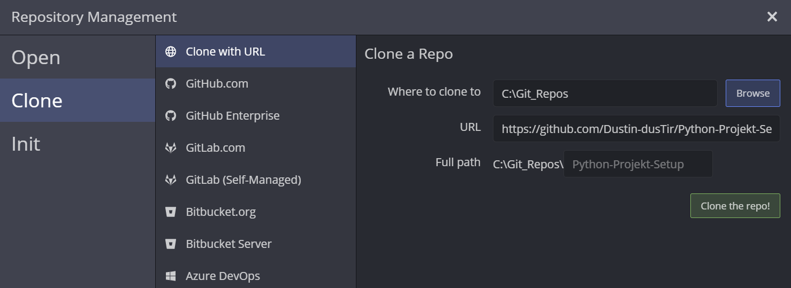
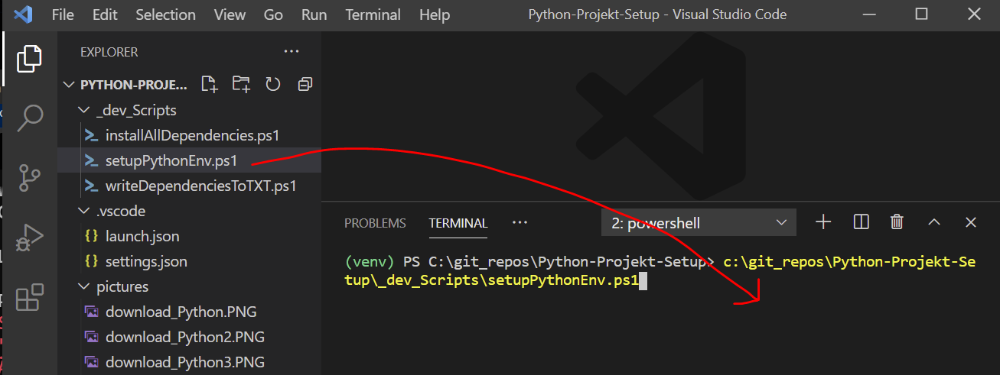

# Python-Projekt-Setup
This is a generell structure, along with a setup guide for the Distributed Systems Projekt at https://www.hhz.de/master/digital-business-engineering/


-  some parts of this setup only work in windows

## Step by step guide

1. read this document carefully and in full
2. first all the downloads:
3. make a github account  https://github.com/
4. download VSCODE https://code.visualstudio.com/download 
5. you can use other Code editors (or IDE) but VSCODE is just the best so.....
6. download python 3.9 https://www.python.org/downloads/  
      
7. check all checkboxes and do Install now  
       
8. if you dont know git I recommend using a git GUI that visualises everything
I like to use https://www.gitkraken.com/ (free version only works for public github repositorys); 
u can also use https://www.sourcetreeapp.com/
or a git extension inside VSCode)
9. now you should have everything downloaded and have all the accounts and stuff
10. now try out python in your commandline (u can use the Terminal in VSCode ) ('ctrl + ö', if it is not visible)
    ``` powershell
    py -0  # to see which python versions you have installed
    py # to start python
    # continue as shown in the image below
    # ctrl + z is the same as quit()
    ```
    
      

11.   py -h # a -h or -?   in the commandline next to a command is sometimes helpfull, to see what you can do
12.   Now python should work on your system and we can proceed
13.   Note: it could be that you have to restart your system or add your python installation manually to your path, for the 'python' or 'python3' command to work
14.   restart your pc, because ... windows .... maybe do it twice, just to be sure i dont know (I did not need to do it)
15.   Now: you will use pip  (not anaconda) to manage your python enviroment and python modules (or packages, not sure  what the correct name is)
16.   Open the terminal, and  type
    ```powershell
    pip -V #to make sure your pip is connected with your 3.9 version
    pip list # to show which python packages are installed
    py -3.9 -m pip install --upgrade pip # to update your pip installation
    pip install numpy # to install a python package (here numpy)
    ```  

      

17.    now you could use your python installation (python enviroment), that is installed in c:\users\du-wa\appdata\local\programs\python\python39\  
But thats kind bad, because then you use the same python enviroment for all of your personal projekts. Which means changing something for one of your python projekts could screw up your other projekt.
Also if you work with multiple poeple on the same projekt, it is hard to make sure, that everyone has the same enviroment setup and everyone has the same package versions installed.
It will happen, that you want to install a new package and then it works for one of you and maybe the other teammember gets it working, but for whatever reason it doesnt work for one. (maybe because windows) \rant off

18.  You want to use a virtual enviroment; but if you are lucky this repository will handle everything for you :D
19.  Learning stuff: !!! you want to lean the basics of python https://www.youtube.com/watch?v=f79MRyMsjrQ   this one looks very good! (If you found some other good resources, make an issue on this github)
20.  You want to learn some git (use whatever ressource you like / find) ( I liked the tutorials on https://www.gitkraken.com/learn/git/tutorials)
21.  Setup GitKraken: Use sign in with Github.
    Name    Your Teammates will see this name next to your commits
    mail    your mail may be public on github, im not sure
22.  This step only one of your team has to do this: Fork this repository to your own github account 
    
      
    while you are there, smash the star button  
23.  rename your repository
24.  
      
25.  click on manage access and invite your teammates, so that you can collaborate on the same github repository
26.  now clone your repository with gitkraken
    https://github.com/Your-account/the-name-you-chose    
    as a folder i recommend C:/Git_Repos     
    do not put it in a google drive or Dropbox, or anything that may be synchronized with this kind of service. it may break your git repo  
    dont use spaces or uppercase (just to make sure no stupid programming language complains or has issues with its path)  

    
27. open vs Code -> File -> open Folder C:/Git_Repos/the-name-you-chose
28. install the python extension python
    
  


29. now we set up the virtual enviroment  
    open the folder _dev_Scripts -> drag and drop the setupPythonEnv.ps1 into the terminal (ctrl+ö   , if its not there yet) -> enter  
      
    if windows doesnt let you execute this script (good, you should have at least opend the script to see, what you are executing on your system)  
    you need to open a powershell as administrator
    then copy paste
    ```powershell
    Set-ExecutionPolicy -ExecutionPolicy RemoteSigned
    ```
    now it should work

30. you have created a virtual repository and installed all the packages specified in requirements.txt
31. because of the settings.json the python interpreter should be slected correctly. you can see it in VSCode on the bottom left
32. Your terminal should have a green (venv), signalling that the correct python enviroment is active.( if not you can close and reopen VSCode; it opens exacly like you have closed it , all your progress is saved, because VSCode is awesome) or you have to click the + button to open a new terminal
33. now you can do
    ```powershell
    pip install numpy # to install packages 
    # and
    pip uninstall numpy # to remove them again
    ```
    because of the green (venv) you dont use the python from the AppData folder, instead the python executable (and the pip executable) are in venv/Scripts/  
    all the installed packages are installed in venv/lib/  
    you could just delete the whole venv folder and generate it back with the ps1 script

34. say: "wow, that is actually kinda nice, I feel like an actual professional programmer now!"
35. "Well, dont ahead of yourself you get. A lot to learn you have youngling"
36. to update the requirements.txt you run the write dependenciesToTXT.ps1, then you need to commit and push the resulting changes, your teammates need to pull these changes and then run the installAllDependencies.ps1 Script
37. There is one more thing I need to show you: the App_Process_Controller Notebook:
    double clik on the notebook. It is kind of the same as a jupyter notebook.  
    click Trust on the popup on the bottom  
    execute one of the cells (multiple times)  
    you should see blue windows poping up. You have just spawn a lot of processes. These could be client or server processes.

38. look inside of the src folder
    I am not yet sure about the folderstructure, and if we want to do a Model View Controller Setup.  
    But look at how I am importing the Middleware class inside the model.py file  
    also have a look at the implementation of a statemashine, to get a feeling for how objektive programming works in python

39. Have fun with this template
40. Feel free to ask me (/ open a issue, if there is something, that is not working out)


give this repository a star!  
follow me on github!  
create an Issue if you want to add something  
or found a mistake or something is missing  